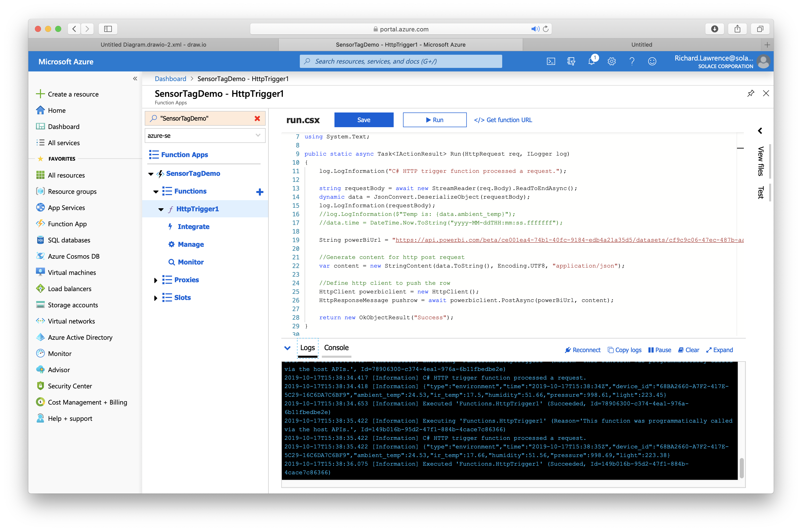
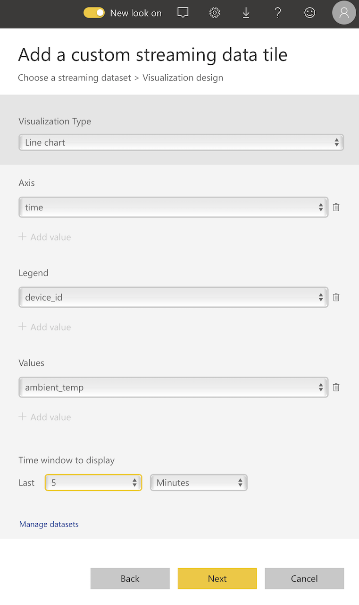

# IoT Integration To Azure Power Bi Demo

This demo can be used to show IoT integration using Solace to Azure Power BI. 

An IoT SensorTag device sends environment information, such as temperature, humidity, pressure etc. to an IOS application using Bluetooth, this is then published to Solace Cloud using MQTT. Solace Cloud is configured to forward the sensor data to Azure to be displayed on a real-time Power BI dashboard via an Azure Function.


## Demo Requirements

* Texas Instruments SensorTag CC2650
* Apple iPhone (or iPad)
* IOS SensorTag MQTT Application
* Solace PubsSub+ Cloud Service
* Azure Function
* Azure Power BI Dashboard

## Setting Up The Demo

To setup the demo requires the following steps:

* Obtain a TI SensorTag
* Building the supplied IOS application and testing on an IOS device
* Creating and Configuring a Solace Cloud PubSub+ Service
* Creating an Azure HTTP Trigger Function
* Creating an Azure Power BI dashboard

Note; The IOS application can also be used standalone to publish sensor data to any MQTT broker

## Obtain A TI SensorTag

This demo uses a Texas Instrument CC2650 Bluetooth SensorTag available [here](http://www.ti.com/tool/CC2650STK)
 direct from TI or other retailers, or there is a device available in London office that can be borrowed.

## Building The IOS Application

- Download the SensorTagMQTT-Project contained in this repo and open this in Xcode.
- Note: Ensure to open using the xcworkspace file and NOT the xcodeproj file.
- Attach an IOS device to your Mac and select your device as the target for the build
- Note: this project was tested with an iPhone 8
- Optionally, edit the MqttModelController.swift file for your Solace Cloud connection details (these can be set when running the app on the MQTT page but will not be saved if the app is restarted)
- Run the project which will install and run the app on your device
- The App will now be available to run directly on the device without the requirement of Xcode
- Note; you may be required to sign the app with your own developer id in the build settings

## Testing The IOS Application

On running the application the SensorTag scene will be shown and it will attempt to automatically connect the the SensorTag. The scene displays a table with three sections, a status section, and two sections showing environment and movement sensor data from the IoT device.


The application will also attempt to automatically connect to the configured MQTT port on Solace Cloud broker. To change the MQTT settings click on the MQTT button on the navigation bar to display the MQTT Scene. This scene also shows the last published environment and movement MQTT messages published.


The application publishes two message types, one for environment data and one for movement data. A different topic maybe configured for each message type (note; if the topic name is empty this will disable publication of this message type.)

The message format for the two message types is simple JSON as shown below:

```
{
	"type":"environment",
	"time":"2019-10-18T11:43:18Z",
	"device_id":"68BA2660-A7F2-417E-5C29-16C6DA7C6BF9",
	"ambient_temp":25.56,"ir_temp":18.31,
	"humidity":44.67,
	"pressure":993.89,
	"light":227.45
}
```

```
{
	"type":"movement",
	"time":"2019-10-18T11:43:18Z",
	"device_id":"68BA2660-A7F2-417E-5C29-16C6DA7C6BF9",
	"accelerometerX":0.13,
	"accelerometerY":-0.03,
	"accelerometerZ":1.22,
	"gyroscopeX":1.95,
	"gyroscopeY":-3.34,
	"gyroscopeZ":-0.03,
	"magnetometerX":18.44,
	"magnetometerY":47.07,
	"magnetometerZ":-35.98
}

```

## Creating and Configuring a Solace Cloud PubSub+ Service

Create a Solace Cloud service and setup the following configuration:

- Create a queue to receive sensor tag messages.
- Create a topic subscription on the queue, for example for environment data use topic "sensortag/environment"
- Create a RDP, bind it to the queue and configure the RDP to call your Azure Function API (from the next section) using REST POST 
## Creating an Azure HTTP Trigger Function

Login to the Azure portal and check the azure-se subscription to see if there is an existing SensorTagDemo Function App that can be reused.
If not to create a new resource and function follow these steps:

- Create new resource and select Function App
- Give the app a name such as SensorTagDemo, select location etc and click create.
- The resource will be created in the background, click notification icon at top of window, see when deployment succeeds
- Select Go To Resource  and Select Pin To Dashboard
- Use resource to create a new function
- Select in portal, continue
- Select web hook + API, and click Create
- Copy the Function URL to use to configure the RDP in the previous section. (Note you should be able to edit the URL to call the function with http instead of https)
- Edit function code to receive REST payload and forward to Power BI API (from next section), your code should look like:

```
#r "Newtonsoft.Json"

using System.Net;
using Microsoft.AspNetCore.Mvc;
using Microsoft.Extensions.Primitives;
using Newtonsoft.Json;
using System.Text;

public static async Task<IActionResult> Run(HttpRequest req, ILogger log)
{
    log.LogInformation("C# HTTP trigger function processed a request.");

    string requestBody = await new StreamReader(req.Body).ReadToEndAsync();
    dynamic data = JsonConvert.DeserializeObject(requestBody);
    log.LogInformation(requestBody);
    //log.LogInformation($"Temp is: {data.ambient_temp}");

    String powerBiUrl = "https://api.powerbi.com/beta/ce001ea4-74b1-40fc-9184-edb4a21a35d5/datasets/cf9c9c06-47ec-487b-aa53-ef8c077feee2/rows?redirectedFromSignup=1&key=VWhcjma0SB8NzmwI2I0N9bhnbBNT9F9iTQTHhQZOsRpx%2F%2Bt0NKn1j5WS6kguF38KdJa8DsvcHaiumSdXT%2BvRrg%3D%3D";
    
    //Generate content for http post request
    var content = new StringContent(data.ToString(), Encoding.UTF8, "application/json"); 

    //Define http client to push the row
    HttpClient powerbiclient = new HttpClient();
    HttpResponseMessage pushrow = await powerbiclient.PostAsync(powerBiUrl, content);
 
    return new OkObjectResult("Success");
}

```

When testing the function show the logs to check for trace and errors, also the monitoring screen shows a call history.




## Creating an Azure Power BI dashboard

To create a Power BI Dashboard follow these steps. For additional help see [here](https://docs.microsoft.com/en-us/power-bi/service-real-time-streaming)

* Login into [Power Bi Portal](https://app.powerbi.com/home)
* Under your Workspace create a new streaming dataset and select API
* Add a name and fields to the dataset as below:


* Once created click on info to show the API URL, copy and use this in the Function in the previous section


* Create a new dashboard and create tiles for the various sensor fields


* Attach the tile to the streaming dataset:


* Select tile type and dataset fields, for example for a line chart select:



* Add further tiles as required, your completed working dashboard should look something like this!


## Contact

Contact: [richard.lawrence@solace.com](mailto:richard.lawrence@solace.com)

